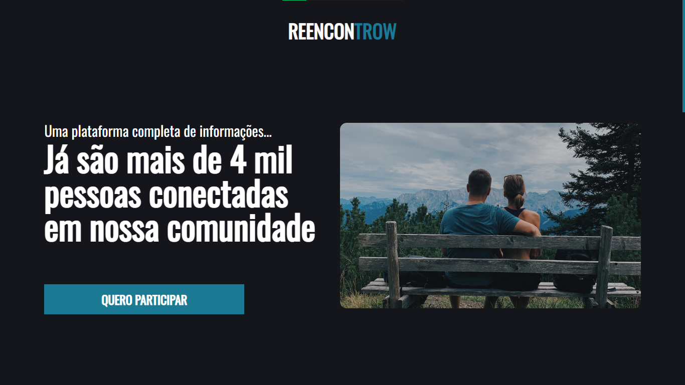

# Reencontrow - Lading Page

Lading page sobre uma comunidade de relacionamento.

## Créditos
Site feito como estudo e práticas de desenvolvimento web.  
Todos os créditos do design do site vão para o Jefferson Vasconcellos. Seu canal no youtube: <https://www.youtube.com/channel/UC_WO2iwoesNlqEKX5EyheuA>
## Tecnologias utilizadas

  
  
  

## Principais Conceitos

- Flexbox.
- Unidades de medida responsíveis.
- Clean code & Refatoração.
- Intersection Observer HTML5 API -> Eventos de Scroll.
- Responsividade.
- Acessibilidade.

## Deploy
https://vitorsantos920.github.io/reencontrow/
## Imagem do Projeto
